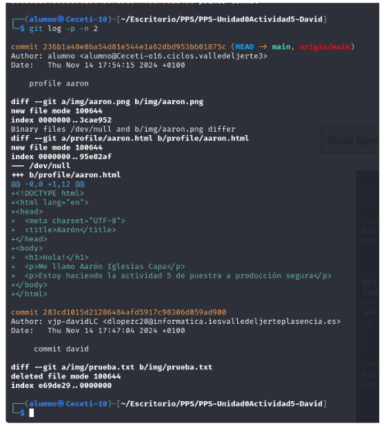

PPS-Unidad0Actividad5-David

 Índice
- [Creación del repositorio](#creación-del-repositorio)
- [Viendo los remotos](#viendo-los-remotos)
- [Visualizando la página web](#visualizando-la-página-web)
- [Colaborando](#colaborando)
- [Erre que erre con Git Logs](#erre-que-erre-con-git-logs)

### Creación del repositorio
Crea tu proyecto en tu dispositivo local puedes hacerlo clonando este repositorio (Recuerda que para tu proyecto se deberá crear una carpeta en tu equipo con nombre PPS-ActividadUnidad0-TuNombre o sea que la sintaxis de git clone deberá ser un poco más compleja que el nombre del repositorio) o bien crea tu repositorio desde cero y vas creando y copiando las carpetas y archivos necesarias.

### Viendo los remotos
Con git remote -v podemos ver los repositorios remotos que tenemos configurados.

1. Mirá tus remotos.

### Visualizando la página web

1. Visualiza con php el contenido de la página web( php -S 0:8080).
   
   

2. Introduce dentro de la carpeta img una imagen de tu foto o avatar. El nombre del archivo debe de llevar como nombre tu nombre.

   
3. Dentro de la carpeta profile crea un archivo html con el mismo nombre del archivo de la imagen que copiaste en el punto anterior.

   
4. Lanza el comando php para que se muestre el contenido de la página web y ver cómo se ha modificado.
   
   

### Colaborando

Podemos añadir colaboradores en nuestro proyecto desde la Configuración del Repositorio, apartado Collaborators. Éstos podrán realizar cambios en él.

1. Comparte tu proyecto con al menos dos compañeros.
   
   

2. Para cada uno de los proyectos de tus compañeros:
    i. Acepta la invitación de colaboración en su repositorio.

    

    

    ii. Clona el repositorio (Recuerda que tendrás que crear una carpeta nueva para él).

    

    iii. Añade una nueva rama con tu nombre(git branch).
    iv. Cámbiate a la rama que has creado(git checkout).
    v. Comprueba en que rama te encuentras (git status te dá la información).
    vi. Mira los remotos que tienes configurados.

    

    vii. Añade en esa rama tus archivos de usuario (foto y profile).

    

    viii. Sube los cambios de tu rama al repositorio remoto y comprueba que puedes verlos   en la web.

    

    

    

*Ahora vamos a hacer modificaciones en la rama main de tus compañeros. Es importante que el tiempo entre el push y el pull sea pequeño, ya que si en ese tiempo hay modificaciones por parte de otro colaborador, es posible que haya inconsistencias, en cuyo caso tendremos que utilizar git merge.*

1. Cambiate a la rama main de los proyectos de tus compañeros
   
    

2. Sincroniza en local la rama main. (puedes comprobar qué compañeros han subido datos lanzando la aplicación web con php).
   
    

3. Añade en ella tus archivos de usuario (foto y profile).
   
    

4. Sube los cambios a la rama main de los repositorios de tus compañeros.

    

    

5. Vuelve a tu repositorio.

    

6. Comprueba en qué rama te encuentras.

    

7. Comprueba que tus compañeros hayan creado sus ramas en tu repositorio (git branch). Si no es así...!!!! échales una mano, hombre¡¡¡¡¡

    

Como resultado de mi index.php:

### Erre que erre con Git Logs
Repasemos git logs
1. Muestra los logs

2. Muestra los logs de los últimos 3 commits

    

3. Muestra los logs utilizando el modificador --pretty

    

4. Muestra los logs de los últimos 2 commits donde se vean las diferencias de cada una de las entradas.

    

5. Muestra los logs de las modificaciones realizadas en el último día

